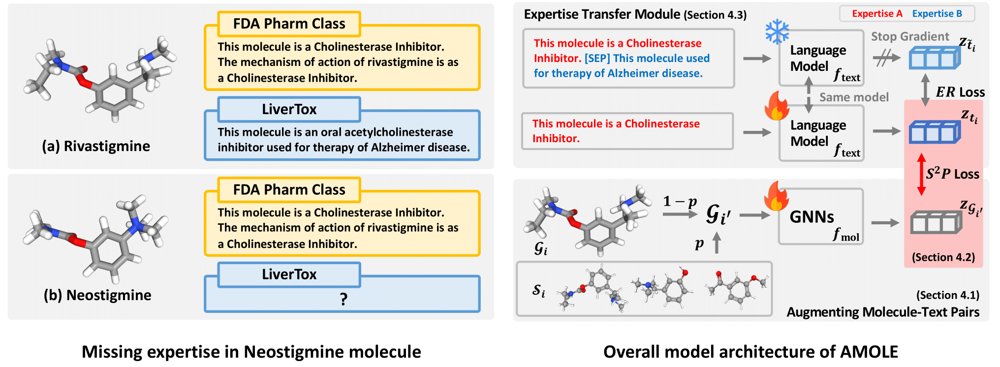

# AMOLE

The official source code for **Molecule Language Model with Augmented Pairs and Expertise Transfer**.


## Overview
Recently, there has been a growing interest among researchers in understanding molecules and their textual descriptions through molecule language models (MoLM). 
However, despite some early promising developments, the advancement of MoLM still trails significantly behind that of vision language models (VLM).
This is because, different from the VLM, unique challenges exist in the field of MoLM due to 1) a limited amount of molecule-text paired data and 2) missing expertise that occurred due to the specialized areas of focus among the experts.
To this end, we propose AMOLE, which 1) augments molecule-text pairs with structural similarity preserving loss, and 2) transfers the expertise between the molecules.
Specifically, AMOLE enriches molecule-text pairs by sharing descriptions among structurally similar molecules with a novel structural similarity preserving loss. 
Additionally, we propose an expertise reconstruction loss to transfer knowledge from molecules that have extensive descriptions to those with fewer descriptions.
Extensive experiments on various downstream tasks, including two novel tasks named zero-shot question and answering task and zero-shot virtual screening task, 
demonstrate the superiority of AMOLE in a more intricate understanding of molecules and their descriptions, and highlight potential applicability in real-world drug discovery.

</img> 

## Environment
We conduct enviroments with the following packages
```
Python version: 3.7.16

rdkit version: 2020.09.1.0
Pytorch version: 1.10.1
Torch Geometric version: 2.0.3
PyTDC version: 0.4.1

# For SciBERT
boto3 version: 1.7.62
transformers version: 4.30.2
```

We provide whole conda environment used during the experiments in ``AMOLE.yml``.

## Pre-training AMOLE

### Dataset Preparation
Please follow the instruction for preprocessing step of [previous work](https://github.com/chao1224/MoleculeSTM/tree/main?tab=readme-ov-file#2-datasets-and-preprocessing) for extracting the data from PubChem database.

After preparing the data, please put the data into `./data/PubChemSTM/raw/` directory.
The output structure should be like this:
```
data/
├── PubChemSTM
    └── raw
        └── CID2name_raw.json
        └── CID2name.json
        └── CID2text_raw.json
        └── CID2text.json
        └── CID2SMILES.csv
        └── molecules.sdf
```

By running `TanimotoSTM.py` code, it will automatically further preprocess the datasets provided in the `./data/PubChemSTM/raw/` directory.

After running the code, you should run `create_same_CID.py` and `create_similarities_CID.py`.

`create_similarities_CID.py` will create the dictionary containing the CID and corresponding structurally similalar molecules' CIDs.

`create_same_CID.py` will create text list of same CID.


### Initial Checkpoints

Following MoleculeSTM, we initialize the language model (LM) and graph neural network (GNN) with pretrained checkpoints.

For **LM**, we use the SciBERT checkpoints provided by the original authors in [huggingface repository](https://huggingface.co/allenai/scibert_scivocab_uncased).
This can be easily done by using the following code:

```
text_tokenizer = AutoTokenizer.from_pretrained('allenai/scibert_scivocab_uncased', cache_dir=pretrained_SciBERT_folder)
text_model = AutoModel.from_pretrained('allenai/scibert_scivocab_uncased', cache_dir=pretrained_SciBERT_folder).to(device)
```

For **GNN**, we use the GraphMVP checkpoints provided by the original authors in [Google drive link](https://drive.google.com/drive/u/1/folders/1uPsBiQF3bfeCAXSDd4JfyXiTh-qxYfu6).
After downloading the checkpoints, please put the downloaded checkpoint into `./data/PubChemSTM/pretrained_GraphMVP` directory.

### Start pretraining
To run the code, you have two options:

**[Option 1]** Train model with shell script
```
sh ./sh/pretrain.sh
```

**[Option 2]** Train model without shell script
```
python pretrain.py
```

Following hyperparameters can be passed into `pretrain.py`:

``target_T``: Temperature hyperparameter for pseudo label ($\tau_1$ in eq. 3).

``T``: Temperature hyperparameter for model prediction ($\tau_2$ eq. 4).

``p_aug``: Augmentation probability $p$. Given the probability, we randomly substitute original molecule $\mathcal{G}_{i}$ to the molecule in $\mathcal{S}_{i}$.

``num_cand``: Number of pre-defined structurally similar molecules $k$.

``alpha``: Hyperparameter for controlling the weight of the expertise reconstruction ($ER$) loss $\alpha$.


## Downstream Tasks

After pretraining step, the python code will automatically save the checkpoints in `./model_checkpoints/`. With the saved checkpoints, you can perform various downstream tasks.

## Zero-Shot Cross-Modal Retrieval

### Dataset Preparation
For zero-shot cross-modal retrieval task, we use the preprocessed dataset provided by the MoleculeSTM authors' [huggingface repository](https://huggingface.co/datasets/chao1224/MoleculeSTM).

For Description dataset, we use `MoleculeSTM/DrugBank_data/SMILES_description_removed_from_PubChem_full.txt`.

For Pharmacodynamics dataset, we use `MoleculeSTM/DrugBank_data/SMILES_pharmacodynamics_removed_from_PubChem_full.txt`.

For ATC dataset, we use `MoleculeSTM/DrugBank_data/SMILES_ATC_5_full.txt`.

After downloading the datasets, please put the txt files into `./data/Drugbank/raw` directory.

### Evaluate the model performance
You can evaluate the model performance with following codes:
```
# If you are using shell scripts
sh evaluate_retrieval.sh

# If you are not using shell scripts
python evaluate_retrieval.py
```

Following hyperparameters can be passed into `evaluate_retrieval.py`:

``input_model_config``: Name of pretrained checkpoint.

``dataset``: Which dataset to evaluate. You can choose among the `description`, `pharmacodynamics`, `ATC`.

``test_mode``: You have two test modes for this task. First, given a molecule retrieve the most relevant description `given_molecule` . Second, given a description, retrieve the most relevant molecule `given_text`. 


## Zero-Shot Question and Answering

### Dataset Preparation
We generate questions based on the textual descriptions used for the cross-modal retrieval task.
Specifically, we employ GPT-4 to craft a multiple choice question with five options, each based on the textual descriptions of molecules.
Further details on generating QA dataset is provided in Appendix C.2.

### Evaluate the model performance
You can evaluate the model performance with following codes:
```
# If you are using shell scripts
sh evaluate_QA.sh

# If you are not using shell scripts
python evaluate_QA.py
```

Following hyperparameters can be passed into `evaluate_QA.py`:

``input_model_config``: Name of pretrained checkpoint.

``dataset``: Which QA dataset to evaluate. You can choose among the `description`, `pharmacodynamics`. 


## Molecular Property Prediction

### Dataset Preparation
For molecular property prediction task, we use the preprocessed dataset provided by the MoleculeSTM authors' [huggingface repository](https://huggingface.co/datasets/chao1224/MoleculeSTM).

After downloading the datasets in `MoleculeNet_data`, please put the txt files into `./data/MoleculeNet_data` directory. 
The directory may be like the followings:
```
data/
├── MoleculeNet_data
    └── bace
    └── bbbp
    └── clintox
    └── hiv
    └── muv
    └── sider
    └── tox21
    └── toxcast
```

### Evaluate the model performance
You can evaluate the model performance with following codes:
```
# If you are using shell scripts
sh evaluate_mpp.sh

# If you are not using shell scripts
python evaluate_mpp.py
```

Following hyperparameters can be passed into `evaluate_mpp.py`:

``input_model_config``: Name of pretrained checkpoint.

``dataset``: Which dataset to evaluate. You can choose among the `bace`, `bbbp`, `clintox`, `hiv`, `muv`, `sider`, `tox21`, `toxcast`. 


## Zero-Shot Virtual Screening

### Dataset Preparation
For zero-shot virtual screening task, we mainly use the datasets provided in [Therapeutics Data Commons](https://tdcommons.ai/).
The dataset will be easily downloaded by running the following codes:

```
dataset = TDC_Datasets_Graph(args.dataspace_path, args.dataset)
```

On the other hand, for VDR dataset, we use the dataset provided by [LIT-PCBA](https://drugdesign.unistra.fr/LIT-PCBA/).
To use the dataset, please download the dataset from the site and put the downloaded csv file into `./data/TDC/VDR/raw/` directory.

Note that we sample a subset of 10,000 drugs from the inactive category for analysis, i.e., a total of 10,655 drugs, in VDR dataset due to the significant imbalance between active and inactive drugs.


### Evaluate the model performance
You can evaluate the model performance with following codes:
```
# If you are using shell scripts
bash evaluate_vs.sh

# If you are not using shell scripts
python evaluate_vs.py
```

Following hyperparameters can be passed into `evaluate_vs.py`:

``input_model_config``: Name of pretrained checkpoint.

``dataset``: Which dataset to evaluate. You can choose among the `HIA`, `Pgp_Inhibition`, `DILI`, `VDR`, `Bioavailability`, `BBB`, `hERG`, `HIV`. 

``prompt``: Textual prompt for virtual screening.

``topk``: Number of screened molecules.